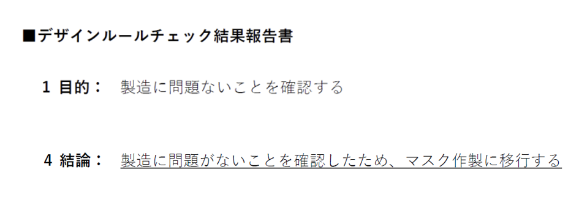

# [Advent Calendar 2024 オープンソース半導体](https://qiita.com/advent-calendar/2024/osssilicon)の18日目の記事
## ISHI会の東海理化シャトル、テープアウトしました！
10月に募集した[ISHI会版OpenMPW TR10-1](https://ishi-kai.org/openmpw/shuttle/tr10/2024/10/15/shuttle_ISHI-Kai_OpenMPW-TR10-1_start.html)ですが、本日のテープアウト期日までにテープアウト完了しました！！！  
[ISHI会版OpenMPW TR10-1の投稿用github](https://github.com/ishi-kai/ISHI-KAI_Multiple_Projects_OpenMPW_TR10-1)に投稿した回路図やレイアウトファイル、参加してみての感想などありますので、「次回、参加してみようかな」など考えている人はご一読してもらえればと思います。  

- 
- 

## 感想
### 総括
私にとっては、今回は、初めてテープアウトまで担当したシャトルとなりました。  
いままでは、自分の担当分の回路設計とレイアウトのみを行い、フレームへの配置や統合後のDRCなどはほかの人にお願いしていました。  

今回やってみての感想としては、「なるほど、統合するときにはこんなことの想定があるのか」というのが分かった点がデカいですね。  
次回からは、各回路の設計の段階から、その辺を考慮した設計ができるような気がします。（気がするだけですが…）  

もし、詳細が気になる人は、次回の時にでも、これをやる「裏方」に手を挙げてもらえればと思います！  
（NDAなど絡む点があるため、少々濁しております。ご了承ください。）  

### 苦労ポイント
今回の東海理化シャトルは、初のオープンソースEDAを利用したシャトルということで、いろいろとトラブルなどもありましたが、初めてのシャトルの割にはバグなどは少なめだったように思います。  
私のような「トラブルこそ、技術力アップのチャンス！」と考えている頭のおかしい人間からすると、ちょっと物足りなかった感はあります。  
（まぁ、締め切り2日前に完成なので、あまりにトラブったら、間に合わなかったですけど。。。）  

とはいっても、半導体のシャトルなんて、もう枯れ切ったシャトルしかないため、このようなちょっとでもトラブルが出て、PDK（ソフトウェアのSDKに相当するシャトルごとのライブラリ集）の中身などを追うなんてことを体験できるというのはとても貴重なので、こういうのが好きな人はぜひとも次回に参加してもらえればと思います！
