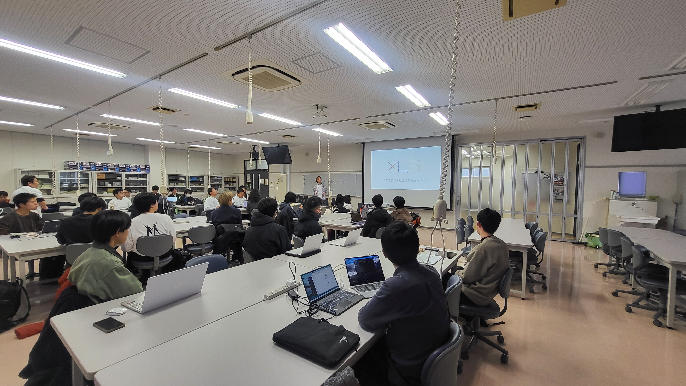
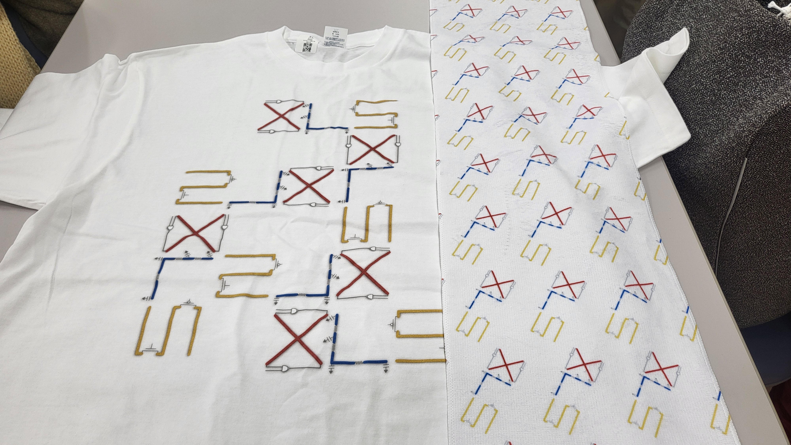

# [Advent Calendar 2024 オープンソース半導体](https://qiita.com/advent-calendar/2024/osssilicon)の20日目の記事
## 「[TOHOKU半導体設計ワークショップ](https://www.tohoku.meti.go.jp/s_monozukuri/topics/241204_2.html)」の「Google開発のオープンソース[XLSツール](https://github.com/google/xls)による半導体設計ワークショップ」のTAしてきた
[OpenAI](https://openai.com/ja-JP/)でも利用中という噂の[XLSツール](https://github.com/google/xls)のワークショップのTA(Technical Assistant)してきたよ！  
とはいっても、実は、TAの大半は東北大の学生さんが担当してくれていたので、私はほぼ置物でした・・・  

- 
- 
- 

※参加者は、20名越えでした！この手のワークショップの割には盛況でした。

### [XLSツール](https://github.com/google/xls)とは？
高位合成言語のひとつです。ですので、Rust風の独自の言語「XLS」で記述した結果をVerilogやSystem Verilogを吐き出します。  
C++と連携したり、UnitTestがデフォルトで使えたりするあたりが、モダン言語な感じですね。  
記述方法とかは「よりソフトウェア的に書ける」感じですね。C++で書けるようになっていることもあり、それ向けにと思われるビット数の指定を変数化できたり、構造体を定義出来たりします。  

狙いとしては、CPU（HDL）の記述者とKernel（C/C++）の記述者をシームレスに繋げることとのこと。なので、C++と連携しているようです。  

ということで、[OpenAI](https://openai.com/ja-JP/)に就職を狙っている人は、ぜひ、チャレンジしてみてください！！！  

### お土産
XLSのTシャツとタオルのセット。参加者へのお土産とのこと。

- 
