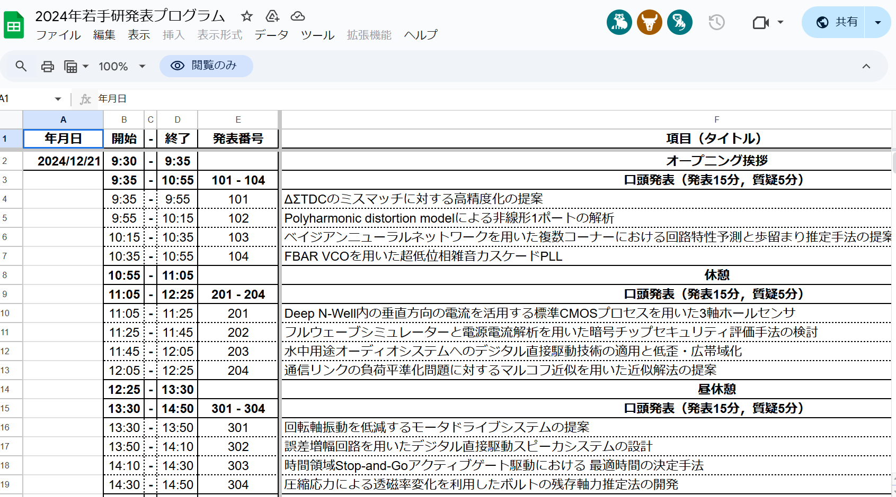
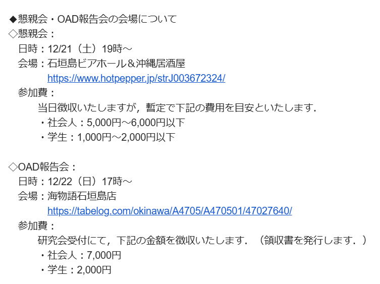

# [Advent Calendar 2024 オープンソース半導体](https://qiita.com/advent-calendar/2024/osssilicon)の21日目の記事
## ICD/CAS研究会 (学生・若手研究会)に参加！
学生・若手研究会という、まさに17歳(+数百か月)の私にぴったりの研究会があるというので、参加してきました！  
（ICD=集積回路研究会, CAS=回路とシステム研究会です。）  
52個の発表がある非常に密度の高い発表会となっております。ですが、これは前座にすぎません！本命は、翌日からのOAD(オープンエアディスカッション)となります！  

- 

## OAD(オープンエアディスカッション)
OAD(オープンエアディスカッション)ということで、グループに分かれて、野外に出て、ディスカッションを行います！！！  
そして、チーム分けはこちら：
- 

アッハイ、「アクティビティにしか見えなんだけど？」という苦情は受け付けておりません！あくまで「ディスカッション」をしております！！！  
その証拠に、OAD報告会の会場も確保されております！！！  

- 

アッハイ、「飲み屋に集合にしか見えないんだけど？」という苦情は受け付けておりません！あくまで「OAD報告会」です！！！  

証拠のOADや会場の風景です。みんな、まじめにディスカッションを行っていることが確認できると思います。  
- 
- 

## 本当の本命
ネタはこの辺にして、本当の本命は「来年のISHI会を動かしてくれそうな学生さんの勧誘」でした。  
OADやら懇親会で仲良くなった学生さんにISHI会に参加してもらって、来年のいろいろなOpenMPWやシャトルのサポートをしてもらいたいと思っております。  
そして、本当に勧誘できたのかは、来年に判明するはずです！！！  
